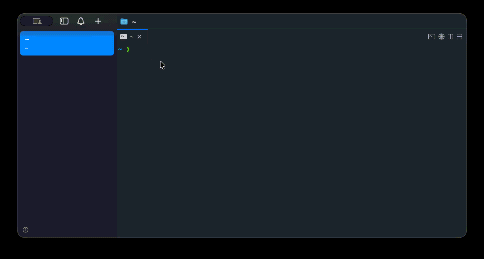
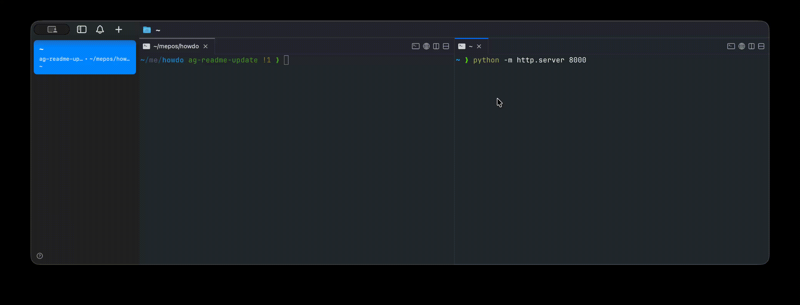

# howdo

Natural language → terminal commands. Just ask.

> **Note:** Tested with Qwen 3.5-9B (reasoning disabled) and GPT-5.2 on macOS. Linux and Windows support is included and CI-validated, but not extensively battle-tested. Some prompt tuning may be needed for other models or platforms. Feel free to [open an issue](https://github.com/GitAashishG/howdo/issues) or submit a PR for bugs, improvements, or model/platform-specific fixes.

```
$ q list files in descending order of size

  ❯ find . -maxdepth 1 -type f -printf '%s\t%p\n' | sort -nr

  Run? (y/e/n) y

  4096    ./README.md
  1234    ./Cargo.toml
```

## Install

### Quick install (no Rust required)

Download a prebuilt binary from [Releases](https://github.com/GitAashishG/howdo/releases) and put it on your PATH:

```bash
# macOS / Linux
curl -fsSL https://raw.githubusercontent.com/GitAashishG/howdo/main/install.sh | sh
```

```powershell
# Windows (PowerShell)
irm https://raw.githubusercontent.com/GitAashishG/howdo/main/install.ps1 | iex
```

Or manually: download the binary for your platform from the releases page, rename to `howdo`, and move to a directory on your PATH.

### Build from source (requires Rust)

```bash
git clone https://github.com/GitAashishG/howdo.git
cd howdo
cargo build --release

# Add to PATH (pick one)
sudo cp target/release/howdo /usr/local/bin/
# or
echo 'export PATH="$PATH:/path/to/howdo/target/release"' >> ~/.zshrc
```

### Shell setup (recommended)

Add this to your `~/.zshrc` or `~/.bashrc` for a short alias with glob protection:

```bash
alias q='noglob howdo'
```

This lets you type `q whats on port 8000?` without the shell expanding `8000?` as a glob.

You can also use the full name directly: `howdo whats on port 8000` (no special characters = no alias needed).

## Setup

Run the interactive configuration wizard:



```bash
howdo /config
```

You'll be guided to pick your provider and enter the required details:

```
  === howdo Configuration ===

  Select your LLM provider:

    1) Local LLM (Ollama, LM Studio, etc.)
    2) OpenAI
    3) Azure OpenAI
    4) Anthropic
    5) Other (OpenAI-compatible)

  Choice (1-5) [1]: 1

  Base URL [http://127.0.0.1:1234/v1]:
  Model name [default]:

  ✓ Configuration saved to ~/.config/howdo/config.json
```

Config is stored in `~/.config/howdo/config.json` (or `%APPDATA%\howdo\config.json` on Windows).

Re-run `howdo /config` at any time to change providers.

## Usage



```bash
howdo <what you want to do in plain english>
# or with the alias:
q <what you want to do in plain english>
```

The tool will:
1. Send your query to the LLM with your OS/shell context
2. Display the suggested command
3. Ask you to confirm before running

### Examples

```bash
q find all python files modified in the last week
q compress this folder into a tar.gz
q show disk usage sorted by size
q kill the process running on port 3000
q create a git branch called feature/auth
```

## How it works

Rust CLI, ~1.6MB binary. Sends one API call with a system prompt including your OS, shell, and working directory. Returns the raw command, asks y/e/n, runs it. That's it.

## Security

- Config file is `chmod 600` (owner-only) on Unix
- API keys can be set via env vars (`OPENAI_API_KEY`, `AZURE_OPENAI_API_KEY`, `ANTHROPIC_API_KEY`) instead of saving to disk
- Destructive commands (`rm -rf`, `dd`, `mkfs`, etc.) get an extra warning before the y/e/n prompt
- Commands are always shown for review — nothing runs without your confirmation

## Supported platforms

- macOS (arm64, x86_64)
- Linux (x86_64)
- Windows (x86_64)

## Development

### Workflow

1. Create a feature branch: `git checkout -b feat/my-change`
2. Make changes, commit, push
3. Open a PR against `main` — CI runs tests on macOS/Linux/Windows automatically
4. Merge when tests pass
5. To release: tag `main` and push — `git tag v0.x.y && git push origin v0.x.y`

### Branch protection (recommended)

Go to **GitHub → Settings → Branches → Add rule** for `main`:
- ✅ Require status checks to pass before merging (select the `test` workflow)
- ❌ Require pull request reviews (not needed for solo dev)
- ❌ Allow force pushes

This keeps `main` always releasable — CI must pass before anything lands.

### Running tests locally

```bash
cargo build --release
bash tests/test_providers.sh          # integration tests (needs python3)
bash tests/bench.sh                   # startup time & binary size benchmarks
```

## License

MIT